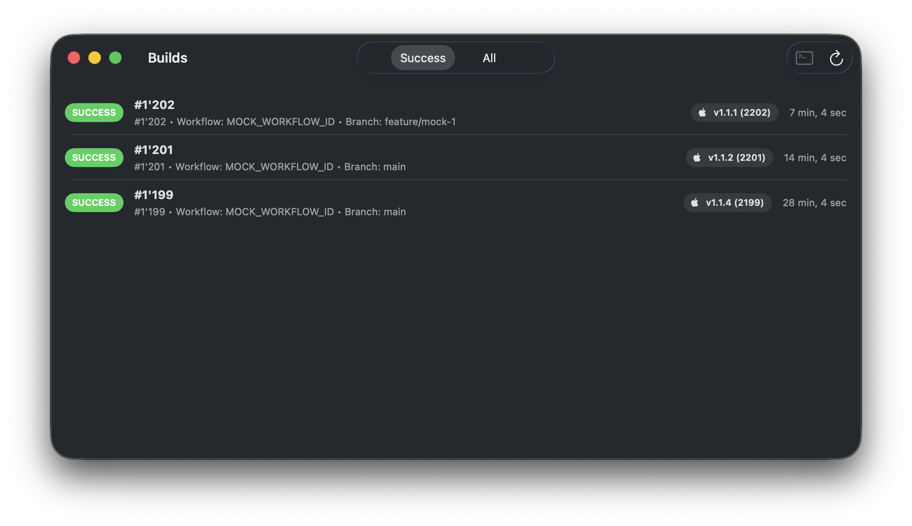
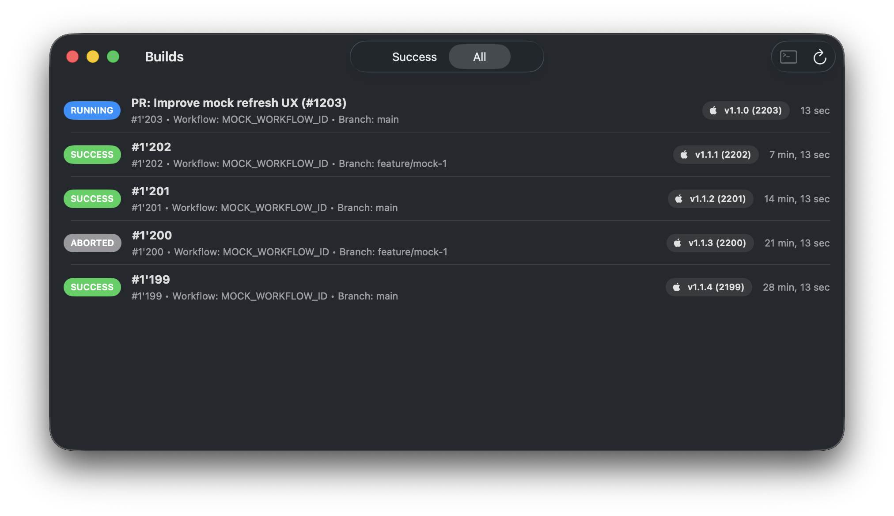
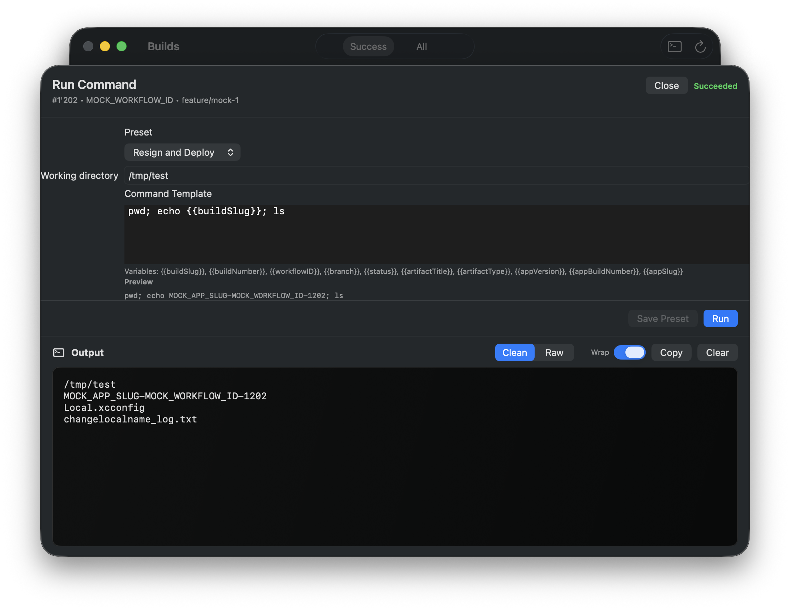

# bitrise-watcher

A lightweight macOS app to monitor [Bitrise](https://bitrise.io) builds and trigger local follow-up actions quickly.

It helps you:
- See recent builds for one app/workflow
- Filter success vs all builds
- Open build details and run local commands from a selected build context
- Reuse command templates with build variables (for example `{{buildSlug}}`, `{{buildNumber}}`, `{{artifactTitle}}`)

## Prerequisites
- Xcode (macOS 26 SDK)
- XcodeGen (`brew install xcodegen`)

## Run locally
```sh
make generate
```

Then open `BitriseWatcher.xcodeproj` and run the `BitriseWatcher` scheme.

## Screenshots






## Configuration (required for real Bitrise data)
The app reads configuration from environment variables, which are injected by the Xcode scheme (from build settings).

Setup:
1. Copy `Configs/Local.xcconfig.example` to `Configs/Local.xcconfig` (gitignored)
2. Fill `BITRISE_API_TOKEN`, `BITRISE_APP_SLUG`, and optionally `BITRISE_WORKFLOW_ID`
3. Run `make generate`, then run `BitriseWatcher`

If `BITRISE_API_TOKEN` is missing, the app shows an error when refreshing.

## Mock mode (optional)
There is a dedicated scheme `BitriseWatcher-Mock` which sets:
- `BITRISE_WATCHER_USE_MOCKS=1`
- mock `BITRISE_APP_SLUG` / `BITRISE_WORKFLOW_ID`
